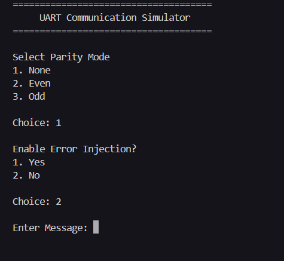
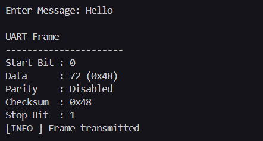
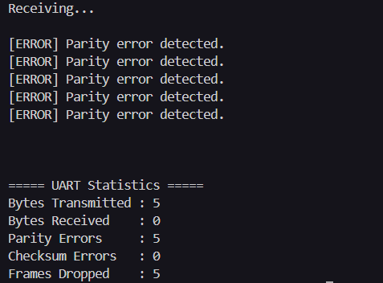
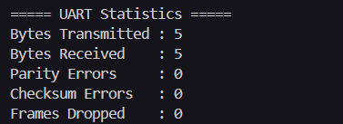

# UART Communication Protocol Simulator

A modular UART (Universal Asynchronous Receiver/Transmitter) communication simulator built entirely in **C** to demonstrate UART frame generation, transmission, buffering, error detection, and communication workflow in embedded systems.

---

# 📑 Table of Contents

- Project Overview
- Project Objectives
- Features
- Technologies Used
- Project Structure
- How It Works
- UART Communication Workflow
- Software Architecture
- Build & Run
- Sample Output
- Screenshots
- Key Learnings
- Future Enhancements
- Author
- License

---

# 📖 Project Overview

UART (Universal Asynchronous Receiver/Transmitter) is one of the most widely used serial communication protocols in embedded systems for communication between microcontrollers, sensors, GPS modules, Bluetooth devices, and other peripherals.

This project simulates the complete UART communication process entirely in software without requiring physical hardware. It demonstrates how UART frames are generated, transmitted, buffered, validated, and received while incorporating common embedded concepts such as parity checking, checksum verification, circular buffering, runtime statistics, and configurable error injection.

The simulator follows a modular firmware-like architecture where each component is implemented as an independent module, making it suitable for learning **Embedded C**, **Firmware Development**, **Communication Protocols**, and **Embedded Software Design**.

---

# 🎯 Project Objectives

This project was developed to:

- Understand UART communication at the frame level.
- Simulate UART communication without hardware.
- Demonstrate modular firmware architecture.
- Implement UART error detection techniques.
- Practice circular buffer and FIFO queue implementation.
- Learn embedded software design principles.
- Build a resume-worthy Embedded C project.

---

# ✨ Features

## 📡 UART Communication

- ✅ UART Frame Generation
- ✅ UART Frame Visualization
- ✅ UART Frame Parsing
- ✅ Configurable UART Parameters
- ✅ Runtime Message Transmission
- ✅ Interactive Command Line Simulator

---

## 🛡 Error Detection

- ✅ Even Parity
- ✅ Odd Parity
- ✅ No Parity Mode
- ✅ Checksum Generation
- ✅ Checksum Validation
- ✅ Start Bit Validation
- ✅ Stop Bit Validation
- ✅ Runtime Error Injection

---

## 📦 Buffer Management

- ✅ Circular Ring Buffer
- ✅ FIFO Frame Queue
- ✅ Buffer Overflow Handling

---

## 📊 Monitoring & Diagnostics

- ✅ Runtime Logger
- ✅ Transmission Statistics
- ✅ Reception Statistics
- ✅ Parity Error Counter
- ✅ Checksum Error Counter
- ✅ Dropped Frame Counter

---

## 🏗 Software Design

- ✅ Modular C Architecture
- ✅ Layered Driver Design
- ✅ Firmware-like Project Structure
- ✅ Independent Functional Modules

---

# 🛠 Technologies Used

| Category | Technology |
|----------|------------|
| Language | C |
| Compiler | GCC |
| Platform | Windows / Linux |
| Programming Style | Modular Programming |
| Concepts | UART, Ring Buffer, FIFO Queue, Embedded Systems, Error Detection |

---

# 📂 Project Structure

```text
uart_cp_simulator/
│
├── include/
│   ├── checksum.h
│   ├── error_injector.h
│   ├── frame_queue.h
│   ├── logger.h
│   ├── ring_buffer.h
│   ├── statistics.h
│   ├── uart_channel.h
│   ├── uart_config.h
│   ├── uart_driver.h
│   └── uart_frame.h
│
├── src/
│   ├── checksum.c
│   ├── error_injector.c
│   ├── frame_queue.c
│   ├── logger.c
│   ├── main.c
│   ├── ring_buffer.c
│   ├── statistics.c
│   ├── uart_channel.c
│   ├── uart_config.c
│   ├── uart_driver.c
│   └── uart_frame.c
│
├── tests/
│
├── screenshots/
│   ├── simulator_menu.png
│   ├── uart_frame.png
│   ├── error_detection.png
│   └── statistics.png
│
├── README.md
├── LICENSE
└── Makefile
```

---

# ⚙️ How It Works

The simulator performs UART communication in the following sequence:

1. Configure UART parameters.
2. Accept a user message.
3. Generate a UART frame for each byte.
4. Compute parity and checksum.
5. Inject transmission errors (optional).
6. Send the frame through the simulated UART channel.
7. Store received frames in the communication queue.
8. Validate Start Bit, Stop Bit, Parity, and Checksum.
9. Recover the transmitted byte.
10. Display communication statistics.

---

# 🔄 UART Communication Workflow

```text
                User Input
                     │
                     ▼
             UART Driver (TX)
                     │
                     ▼
          UART Frame Generation
                     │
                     ▼
        Generate Parity & Checksum
                     │
                     ▼
        Error Injection (Optional)
                     │
                     ▼
          UART Channel (FIFO Queue)
                     │
                     ▼
             UART Driver (RX)
                     │
                     ▼
       Frame Validation
(Start / Stop / Parity / Checksum)
                     │
                     ▼
           Recover Data Byte
                     │
                     ▼
      Update Statistics & Logger
```

---

# 🏗 Software Architecture

```text
              Application Layer
                     │
                     ▼
              UART Driver
          (Transmit / Receive)
                     │
                     ▼
              UART Frame
      (Frame Pack / Unpack)
                     │
                     ▼
            UART Channel
          (Communication)
                     │
                     ▼
              Frame Queue
             (FIFO Buffer)
                     │
                     ▼
             Ring Buffer
         (Temporary Storage)
                     │
                     ▼
             Receiver Output
```

---

# 🚀 Build & Run

## Prerequisites

- GCC Compiler
- Git

---

## Clone Repository

```bash
git clone https://github.com/adyasha-official/uart_cp_simulator.git
cd uart_cp_simulator
```

---

## Compile

```bash
gcc -Wall -Wextra -Iinclude \
src/main.c \
src/uart_driver.c \
src/uart_channel.c \
src/frame_queue.c \
src/uart_config.c \
src/uart_frame.c \
src/ring_buffer.c \
src/checksum.c \
src/logger.c \
src/error_injector.c \
src/statistics.c \
-o uart_simulator
```

---

## Run

### Windows

```bash
.\uart_simulator.exe
```

### Linux

```bash
./uart_simulator
```

---

# 📋 Sample Output

The simulator demonstrates:

- UART Frame Generation
- UART Frame Visualization
- Runtime UART Configuration
- Parity Generation
- Checksum Generation
- Error Injection
- Frame Validation
- UART Reception
- Communication Statistics
- Runtime Logging

---

# 📸 Screenshots

## Simulator Menu

Configure UART parity mode, enable or disable error injection, and enter a custom message for transmission.



---

## UART Frame Visualization

Displays the generated UART frame including the start bit, data byte, parity bit, checksum, and stop bit.



---

## Error Detection Demonstration

Shows how corrupted frames are detected, rejected, and reflected in the runtime statistics.



---

## Communication Statistics

Displays transmitted bytes, received bytes, parity errors, checksum errors, and dropped frames after communication completes.



---

# 📚 Key Learnings

During the development of this project, the following Embedded Systems concepts were implemented:

- UART Communication Protocol
- UART Frame Structure
- Embedded Driver Design
- Circular Ring Buffer
- FIFO Queue Implementation
- Parity Generation & Verification
- Checksum-Based Error Detection
- Runtime Error Injection
- Modular Firmware Design
- Embedded Logging
- Communication Statistics
- Software Layering

---

# 🚀 Future Enhancements

Possible future improvements include:

- CRC-8 Error Detection
- Interrupt-Driven UART Simulation
- DMA-Based UART Simulation
- Configurable Baud Rate Timing
- UART Packet-Based Communication
- Multi-UART Channel Support
- Binary File Transmission
- UART Loopback Testing
- Comprehensive Unit Test Suite
- STM32/AVR Hardware Integration

---

# 👩‍💻 Author

**Adyasha Priyadarshini Sahoo**

M.Tech in Software Engineering

National Institute of Technology Rourkela

GitHub: https://github.com/adyasha-official

Project Repository:

https://github.com/adyasha-official/uart_cp_simulator

---

# 📄 License

This project is licensed under the **MIT License**.

See the `LICENSE` file for more information.
